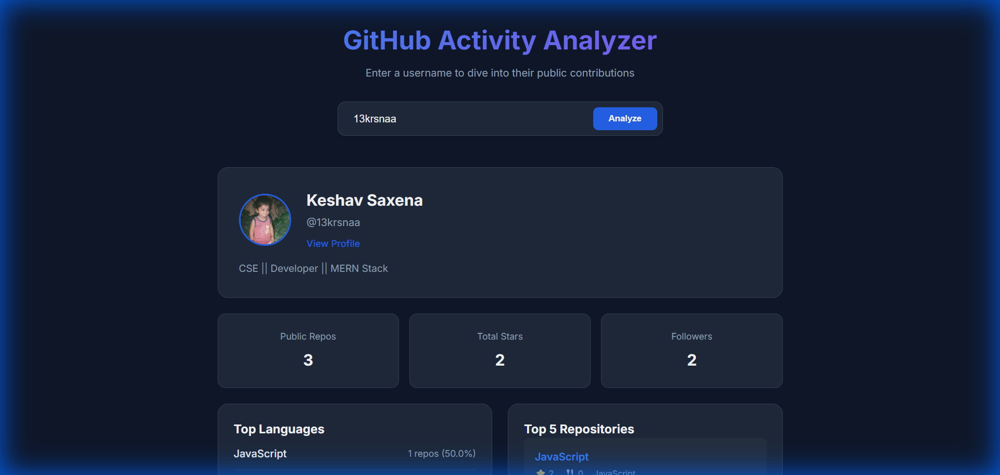

# Mini GitHub Activity Analyzer 🚀

A sleek, professional, and responsive dashboard to analyze GitHub user activity using the official GitHub REST API. Built with high-performance JavaScript and modern CSS.

## ✨ Features

- **Real-time Data Fetching**: Get instant insights using any GitHub username.
- **Activity Analytics**:
  - **Total Stars**: Aggregated across all public repositories.
  - **Language Profile**: Distribution of top languages used.
  - **Top Repositories**: Highlights the most starred projects.
- **Modern UI**: Dark-themed, glassmorphic design inspired by premium dashboards.
- **Responsive**: Perfect viewing experience across desktop, tablets, and mobile devices.
- **User Persistence**: Remembers your last search using LocalStorage.

## 📸 Preview

Searching for [@13krsnaa](https://github.com/13krsnaa):



## 🛠️ Technology Stack

- **HTML5**: Semantic structure.
- **CSS3**: Custom properties (variables), Grid, and Flexbox.
- **JavaScript (ES6+)**: Fetch API, Async/Await, and DOM manipulation.
- **GitHub API**: Public user and repository endpoints.

## 🚀 How to Run

1. Clone or download the project.
2. Open `index.html` in your favorite browser.
3. Enter a GitHub username and click **Analyze**.

## 📁 Project Structure

```text
├── index.html   # Main dashboard structure
├── style.css    # Premium styling and animations
├── script.js     # Core application logic
└── README.md    # Project documentation
```

---

Built by @13krsnaa.
